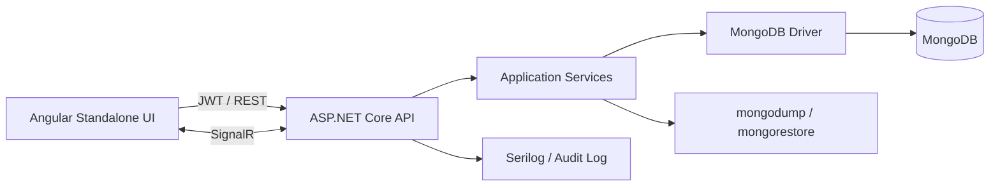

# Kiến trúc EduManage LMS

## Luồng tổng thể

Frontend chia theo `core`, `shared`, `layouts`, `features/auth`, `features/admin`, `features/lecturer`, `features/student`. Backend chia theo `Controllers`, `Application`, `Domain`, `Infrastructure`, `Middleware`, `Hubs` và `Common`. Controller không chứa công thức GPA; các phép tính điểm, GPA và CLO được đưa xuống MongoDB Aggregation Pipeline.

## Bảo vệ dữ liệu nhiều lớp

Route Guard ngăn điều hướng sai vai trò. JWT Authorization kiểm tra role tại controller. Service kiểm tra `lecturerCode`, `studentCode`, lớp được phân công và danh sách sinh viên. Truy vấn MongoDB luôn kèm phạm vi sở hữu, do đó việc tự sửa URL hoặc gọi API trực tiếp không tạo ra quyền mới.

## Snapshot và versioning

`courses.gradingSchemes` lưu nhiều phiên bản. `classSections.gradingSchemeSnapshot` chụp cấu hình áp dụng khi mở lớp. `students.academicRecords...courses` lưu snapshot môn, giảng viên, cấu trúc và điểm thành phần. Thay đổi cấu hình cho năm học mới không sửa kết quả cũ.
